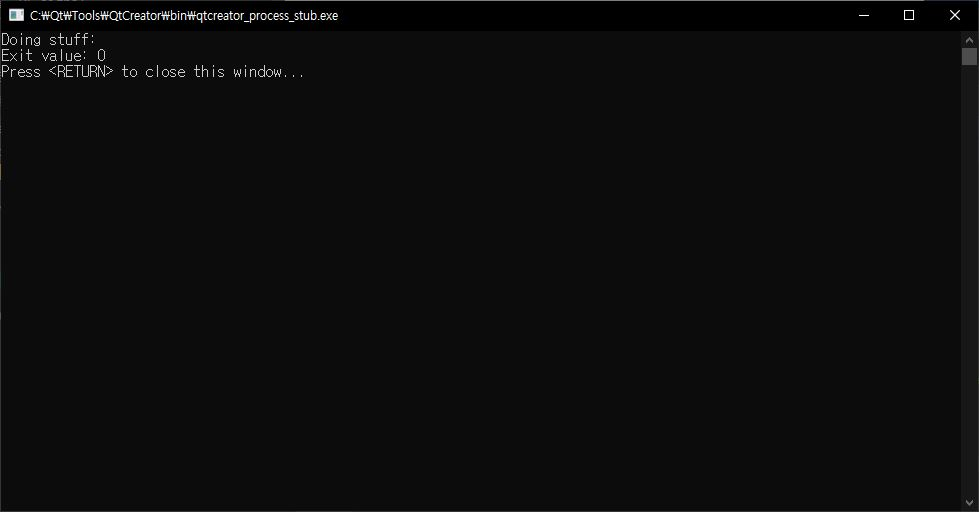

### Qt Episode 4

새로운 class의 Header에 signal(emit을 해줄 함수)와 slots(구동이 될 함수)를 정의한다.


그리고 QObject 혹은 다른 객체에서
connect(signal이 발생하는 클래스, emit을 할 signal,
        signal을 받을 슬롯, 실행 해야할 슬롯, {auto connect})
순으로 함수를 작성한다.

ex) 시그널이 발생하고 Application을 종료하는 connect
```cpp
    QObject::connect(&test, &Test::close,&a,
    &QCoreApplication::quit, Qt::QueuedConnection);
```
QCoreApplication의 exec를 QDebug로 확인해보면 
```cpp
    int value = a.exec();
    qInfo() << "Exit value:" << value;

    return value;
```


value는 0으로 정상적인 종료를 받는 것을 알 수 있다.